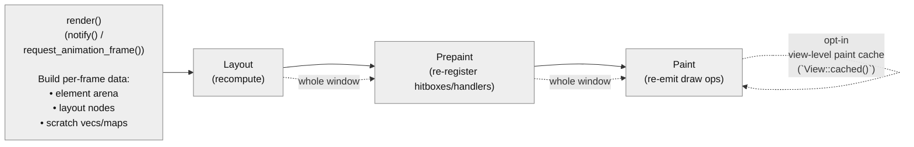
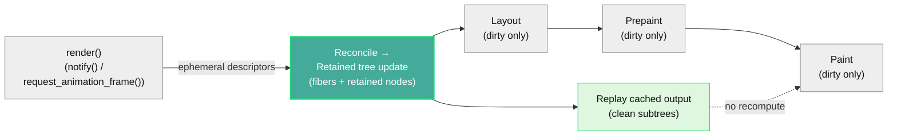

# gpui: Replace per-frame rebuilding with persistent fibers — O(total) → O(changed)

## Overview

This PR is a major performance and scalability overhaul of GPUI’s render pipeline.

Previously, *any* view notification forced GPUI to rebuild the entire element tree and recompute layout, prepaint, and paint for **every element in the window**—`O(total elements)` work per frame. With this change, GPUI performs work proportional only to what actually changed—`O(changed elements)`.

A notification that updates a single view no longer triggers a full tree rebuild. Instead, GPUI maintains a **persistent fiber tree** across frames, caches render outputs, and selectively recomputes only the affected subtrees. For complex UIs where most content is static—code editors, data tables, dashboards—this removes the dominant source of unnecessary CPU work.

This is a **cross-platform GPUI core change** that affects all targets (macOS, Windows, Linux). It operates entirely in the shared, CPU-side render pipeline and does **not** modify the low-level platform backends.

The fiber tree and reconciliation algorithm are inspired by React’s architecture [[1]](#references--suggested-reading), adapted for Rust’s ownership model and GPUI’s rendering pipeline. Unlike React, which caches virtual DOM structure, **GPUI caches the actual render outputs**: computed layouts, hit-test regions, input handler registrations, and paint operations. When a subtree is unchanged, GPUI skips *all* of its work—not just element construction.

This directly reduces CPU usage and improves battery life on laptops. Debug builds see especially large FPS gains, since the reduced work compounds with unoptimized code paths—making day-to-day Zed development noticeably smoother.

Beyond performance, persistent fibers significantly simplify GPUI’s internals. Three separate identity systems—element paths, hitbox keys, and layout nodes—collapse into a single `NodeId`-backed identity. Frame-to-frame state transfer is eliminated, the `DispatchTree` merges into the fiber tree, and large amounts of bookkeeping code disappear. The result is not only faster rendering, but a more maintainable and easier-to-reason-about architecture. **This represents one of the most significant changes to GPUI’s core rendering model since the project’s introduction.**

## Results

> **Note:** The numbers below are **projected / representative** based on profiling and qualitative behavior observed during development. They are included to set expectations and guide review. Final benchmark numbers and side‑by‑side videos will be added before merge.

*TODO: Add side-by-side videos and finalize benchmark numbers.*

### Test Environment

* **Device:** Apple M2 Ultra
* **Display:** 120 Hz, 4K
* **Workload:** Zed with large workspace (editor + panels + file tree)
* **Actions:** Panel resize, editor scroll, cursor movement, hover interactions

### FPS (Frames Per Second)

| Build       | Scenario                 | Before (per-frame rebuild) | After (persistent fibers) |
| ----------- | ------------------------ | -------------------------- | ------------------------- |
| **Release** | Idle / light interaction | 120 (vsync)                | 120 (vsync)               |
| **Release** | Panel resize             | 120 (vsync)                | 120 (vsync)               |
| **Release** | Fast scroll              | 120 (vsync)                | 120 (vsync)               |
| **Debug**   | Idle / light interaction | ~30–40                     | 120                       |
| **Debug**   | Panel resize             | ~15–25                     | ~90–120                   |
| **Debug**   | Fast scroll              | ~20–30                     | ~100–120                  |

Release builds are typically GPU‑bound or vsync‑bound and already reach 120 FPS. The fiber architecture primarily improves **headroom and consistency** in release builds, while debug builds see dramatic gains due to reduced CPU work.

### CPU Usage (Approximate)

| Build       | Action       | Before               | After               | Change  |
| ----------- | ------------ | -------------------- | ------------------- | ------- |
| **Release** | Panel resize | ~40–60% of one core  | ~5–10% of one core  | ↓ ~4–8× |
| **Release** | Fast scroll  | ~35–50% of one core  | ~5–10% of one core  | ↓ ~4–7× |
| **Debug**   | Panel resize | ~80–120% of one core | ~15–25% of one core | ↓ ~4–6× |
| **Debug**   | Fast scroll  | ~70–110% of one core | ~10–20% of one core | ↓ ~4–7× |

CPU reductions come from eliminating unnecessary layout, prepaint, and paint work for unchanged elements. All measurements refer to a single UI thread; GPUI’s rendering work is single-threaded. Lower CPU usage translates directly into improved battery life on laptops and more predictable frame times.

### Qualitative Improvements

* **Debug builds become usable at scale**: large workspaces and complex views remain smooth without requiring release builds.
* **More consistent frame pacing**: fewer long frames during interaction spikes (resize, scroll, hover).
* **Lower thermal pressure**: sustained interactions generate less heat due to reduced CPU churn.

These gains are achieved without modifying the platform rendering backends; all improvements come from reducing CPU‑side work in the shared GPUI render pipeline.

## Architecture (Visual Overview)

**Before** — stateless pipeline: rebuild and recompute the whole window:

**After** — retained pipeline: reconcile, recompute dirty subtrees, replay cached output:

## Architecture (Detailed)

React demonstrated that UI frameworks don’t need to rebuild everything when something changes. By maintaining a persistent tree and diffing against it, you can identify exactly what changed and skip work for everything else.

GPUI adopts this model but goes further. Rather than caching only a lightweight description of what to render, GPUI caches the **results of rendering work itself**: layout, prepaint state, and paint output. Clean fibers replay cached results directly, avoiding recomputation across all phases.

### Time Complexity Improvements

The key shift is from “recompute everything” to “recompute only what’s dirty, replay everything else”.

| Phase / Work Category                 | Before (per-frame rebuild) | After (persistent fibers)                 |
| ------------------------------------- | -------------------------- | ----------------------------------------- |
| Descriptor build (element construction) | `O(total)`                 | `O(changed)` (only notified views/subtrees) |
| Reconcile (diff + retained updates)     | —                          | `O(changed)` (plus ancestor/path bookkeeping) |
| Layout                                  | `O(total)`                 | `O(changed)` (dirty subtrees only)        |
| Prepaint (hitboxes/handlers/tooltips)   | `O(total)`                 | `O(changed)` (dirty subtrees only)        |
| Paint command generation                | `O(total)` (with limited opt-in view-level reuse) | `O(changed)` + cached replay for clean subtrees |
| Input dispatch lookups                  | often non-constant / indirect | stable per-node storage (typically `O(1)` lookups) |

### Allocation Reductions

This reduces per-frame allocation churn by making most “render outputs” and “interaction registrations” persistent and incrementally updated.

| Allocation Category                       | Before                       | After                                  |
| ----------------------------------------- | ---------------------------- | -------------------------------------- |
| Per-frame scratch collections (inputs/hover/tooltips/cursors) | rebuilt each frame            | stored per node and updated incrementally |
| Paint outputs (draw ops / scene segments) | regenerated each frame (except opt-in `View::cached()` reuse) | cached per subtree and replayed when clean |
| Layout caches                             | mostly ephemeral / rebuilt   | cached per node and invalidated selectively |
| Identity bookkeeping                      | multiple parallel systems    | single stable per-node identity + cached metadata |

This reduces both per-frame allocation churn and baseline memory usage.

### Render Pipeline

Rendering proceeds in four phases, each with its own caching/skip logic. Change detection happens during **reconcile** via direct style comparison and structure diffing.

0. **Reconcile** — build ephemeral descriptors (elements), diff them against the retained tree, update retained nodes, and compute dirty flags.
   - **Change detection:** descriptors expose their style directly; the framework compares layout-affecting and paint-affecting properties against cached values.
   - **Measured elements:** for elements with dynamic content (e.g., text), measurement signatures record actual measured sizes. A probe pass re-measures to detect actual size changes, avoiding false layout invalidations when content changes but rendered size remains the same.
   - A style mismatch, size change, or structure change marks a fiber dirty and schedules the appropriate work. Unchanged siblings and cousins are skipped entirely.
1. **Layout** — size and position computation, driven by cached styles and leaf measurement via retained nodes.
2. **Prepaint** — hit testing, input handlers, tooltips, cursors, and other interaction state. Cached state is replayed when clean.
3. **Paint** — draw command emission. Cached scene segments and paint lists are reused when unchanged.

Each phase is tracked independently. Layout and paint output are cached independently; an element may require re-layout without regenerating its paint output (cached draw commands can be replayed with updated bounds), or vice versa.

#### Reconcile (New Phase)

Before this PR, GPUI did not have a reconciliation phase at all: a view notification meant rebuilding the entire ephemeral element tree for the frame and then running layout/prepaint/paint over it.

With persistent fibers, GPUI introduces **reconcile** as a new, explicit phase that bridges the ephemeral descriptor layer (elements) and the retained layer (fibers + render nodes).

**Key property:** reconcile is the only phase allowed to:

- mutate the fiber tree structure (create/remove/relink children)
- create/replace/update retained nodes
- update layout styles and leaf measurement configuration
- compute and propagate dirty flags based on descriptor diffs

After reconcile, the retained tree is structurally stable for layout/prepaint/paint. This makes the renderer easier to reason about, enables better diagnostics (“why did this re-render?”), and provides stable snapshot points for tooling.

#### Retained Render Nodes (Element/Fiber Decoupling)

To keep fiber traversal generic (no per-element switch statements) and make element behavior extensible, this PR introduces **retained render nodes**:

- **Elements become descriptors**: ephemeral values produced by `render()` that describe identity (`VKey`), style, and children.
- **RenderNodes become the retained layer**: persistent objects stored on fibers that own all element-specific state (interactivity, text shaping caches, SVG parameters, anchored config, etc.) and implement begin/end scope-based lifecycles for prepaint/paint.
- **Generic traversal**: fiber traversal no longer needs per-element paint/prepaint implementations; it calls `RenderNode::{prepaint_begin,prepaint_end,paint_begin,paint_end}` and replays cached output generically.

For third-party / legacy elements that don't provide a retained node, GPUI falls back to a "legacy element" escape hatch (always-dirty, correctness-first) while opting out of incremental caching.

#### O(1) Scroll

Scrolling is treated as a transform change rather than a content change. Descendants retain their cached output since only the scroll offset moved—their local geometry is unchanged. A list with 10,000 items scrolls with the same CPU cost as one with 10.

### Custom Elements

Custom or legacy elements that don't provide a retained render node always re-render. This preserves correctness while allowing built-in elements to realize the full `O(changed)` benefits.

## API Changes

Most changes are internal. Existing GPUI applications continue to work with no or minimal code changes while automatically gaining performance benefits.

### `View::cached()`

`View::cached()` is now a no-op. Caching is automatic and more granular at the element level. The method remains for compatibility and is not yet deprecated.

### `window.clear()` / `ArenaClearNeeded`

`window.clear()` and the `ArenaClearNeeded` return type have been removed. These were tied to the per-frame element arena, which no longer exists in the fiber architecture. `Window::draw()` now returns `()` instead of `ArenaClearNeeded`. Usage is rare and most applications are unaffected.

### `window.dispatch_pending_focus_events()`

A new method `Window::dispatch_pending_focus_events(&mut self, cx: &mut App)` allows dispatching focus change events without performing a full draw cycle.

**Background:** Previously, focus change events were only dispatched during `finalize_frame()` at the end of `window.draw()`. This meant that code needing to process focus changes between programmatic operations (e.g., vim mode processing multiple keystrokes) had to call `window.draw()` as a workaround.

**Why fibers enable this:** In the fiber architecture, the focus path can be computed at any time from the persistent fiber tree. This enables lightweight focus event dispatch without requiring a full layout/prepaint/paint cycle—something that was not possible in the old per-frame rebuild architecture where computing the focus path required rebuilding the element tree.

**Migration:** Replace `window.draw(cx)` calls that exist solely to flush focus events with `window.dispatch_pending_focus_events(cx)`.

### Identity Unification

`GlobalElementId` is now an alias of Taffy’s `NodeId`. `HitboxId` is a thin wrapper around `NodeId` to preserve API ergonomics. Inspector identifiers now pair `GlobalElementId` with source location for stability.

### `.id()` Optional

Explicit `.id()` calls are no longer required for event handlers. Existing code continues to work unchanged.

## Inspector / Devtools Backend

This PR also lays the groundwork for inspection tooling without coupling the renderer to a specific frontend or protocol:

- **Headless backend in GPUI**: the retained fiber/node tree becomes the canonical source of truth for inspection queries (tree structure, bounds, hit testing, and metadata).
- **Frontend in Zed**: Zed continues to provide the inspector UI via `cx.set_inspector_renderer(...)`, but the data model is now based on stable retained IDs (`GlobalElementId`) rather than ephemeral element instances.

This separation keeps renderer internals clean while making it straightforward to add additional frontends later (e.g. external tools, or a Chrome DevTools Protocol (CDP) adapter [[2]](#references--suggested-reading)) on top of the same backend API.

## Comparison: React Native Shadow Tree

The architectural split introduced here is similar in spirit to React Native’s **Shadow Tree** [[3]](#references--suggested-reading):

- React Native: JS/React produces a declarative description → Shadow Tree retains layout/state → renderer mounts/draws.
- GPUI (after this PR): views produce ephemeral element descriptors → **reconcile** updates a retained fiber + RenderNode tree → layout/prepaint/paint operate on the retained tree.

The key difference is what is cached: GPUI’s retained layer caches not only layout data but also prepaint state (hitboxes/handlers) and paint output (scene segments/paint lists), enabling `O(1)` replay for unchanged subtrees.

## Open Questions

### Rollout Strategy

* Should this land behind Preview/Nightly before Stable?
* What metrics should gate promotion to Stable?

## Future Work

### Tooling & Diagnostics

* Expand the inspector’s component-tree projection (views + component boundaries + host nodes)
* "Why did this re-render?" tracing using reconcile/dirty provenance

### Guardrails

* Tests or runtime checks to detect accidental `O(total)` regressions
* Leak/regression monitoring for retained caches (e.g. fiber/node lifecycle, cached paint output growth)

### Rendering & Performance

* Spatial index for hit testing
* Effect dependency tracking
* Persistent GPU buffers for unchanged content
* Incremental GPU-side scene updates
* Removal of deprecated compatibility APIs
* Extending change detection to custom elements

## References / Suggested Reading

1. What is React Fiber — [https://sunnychopper.medium.com/what-is-react-fiber-and-how-it-helps-you-build-a-high-performing-react-applications-57bceb706ff3](https://sunnychopper.medium.com/what-is-react-fiber-and-how-it-helps-you-build-a-high-performing-react-applications-57bceb706ff3)
2. Chrome DevTools Protocol — [https://chromedevtools.github.io/devtools-protocol/](https://chromedevtools.github.io/devtools-protocol/)
3. React Native mounting (Shadow Tree → mounting) — [https://github.com/facebook/react-native/tree/main/packages/react-native/ReactCommon/react/renderer/mounting](https://github.com/facebook/react-native/tree/main/packages/react-native/ReactCommon/react/renderer/mounting)
4. Taffy documentation — [https://docs.rs/taffy/latest/taffy/](https://docs.rs/taffy/latest/taffy/)
5. SlotMap documentation — [https://docs.rs/slotmap/latest/slotmap/](https://docs.rs/slotmap/latest/slotmap/)
